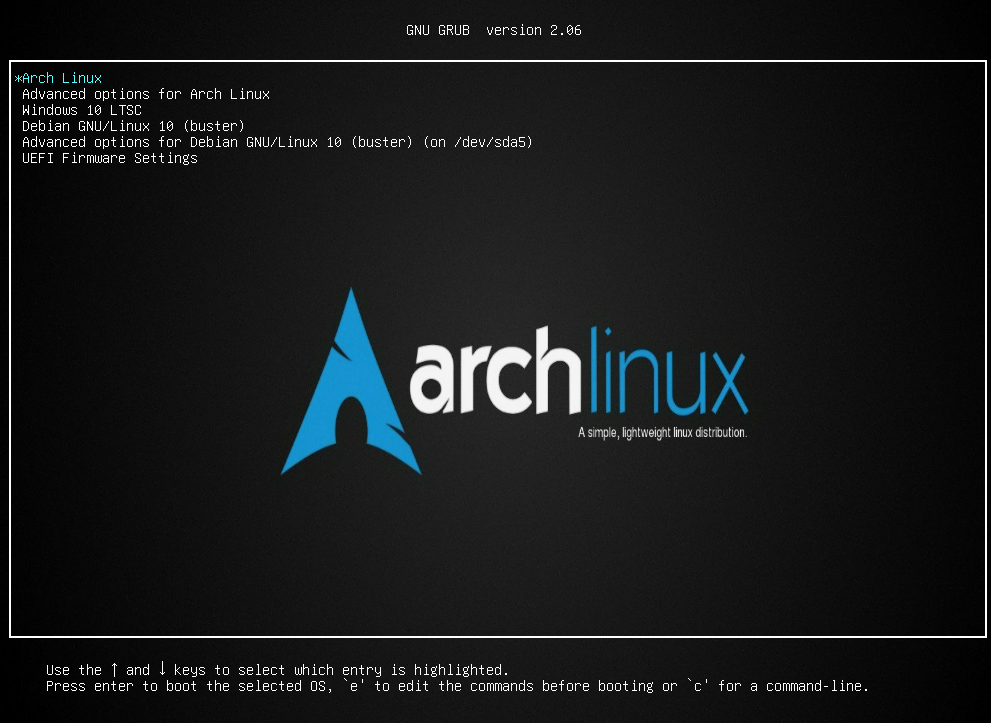
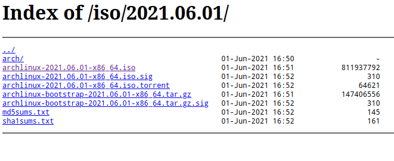
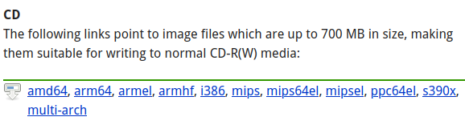

# Multiboot_os Windows 10 LTSC / Debian 10 Server / Archlinux

--- 

**Installation of several operating systems in multiboot on a single virtual machine** .

*The goal is to be able to reproduce this kind of installation on a physical machine such as a laptop or desktop.*

For this example we will use Virtualbox as a vrtualization environment with the following operating systems :

    1. Archlinux (install only with command line)
    2. Debian 10 (buster) server (install with TUI expert mode)
    3. Windows 10 LTSC ( normal graphic mode)

*And as bootloader we will use GRUB (which will allow us to have the choice of systems when starting the computer)*

---

For linux systems, we will need the versions for AMD64 architectures (64bits), for windows you can use any version of windows that you want but alaways for 64bits architecture.

Links download Iso's files of operating systems :

[Download Archlinux](https://archlinux.org/download/)

[Download Debian 10](https://www.debian.org/CD/http-ftp/)

**Useful Links, Debian, Archlinux community :**

- [Archwiki](https://wiki.archlinux.org/)

- [Debianwiki](https://wiki.debian.org/FrontPage)

- [Systemd commands](https://wiki.archlinux.org/title/systemd)

---

[So let's prepare Virtualbox to host our systems](https://github.com/sysroot255/Install_Mutli_Boot_OS/blob/master/step1_prepare_virtualbox.md)

