# Let's configure virtualbox .

**Create a new virtualbox (New), set a name like "Multios" or other.(Select for type "Linux" and for version " Archlinux 64 beacause we will start part of the partitioning with archlinux)**
    

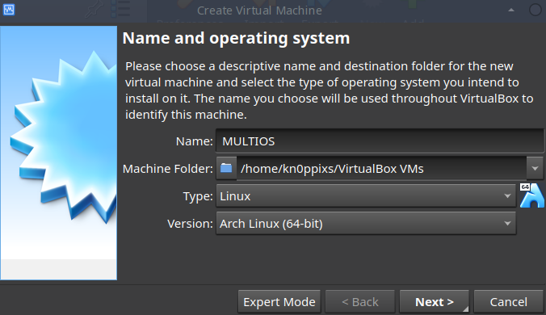

**Choose the memory size (4GB) for example.**

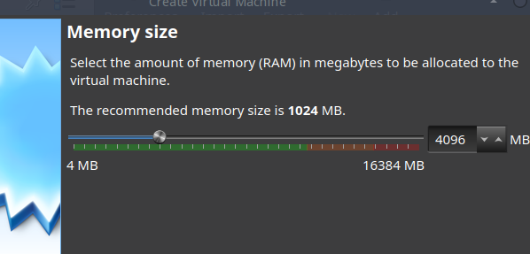

**Create a new virtual hard disk [VDI](https://www.makeuseof.com/tag/3-websites-to-download-virtual-disk-images-for-virtualbox/)**

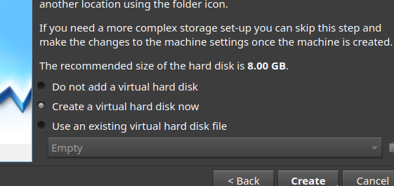
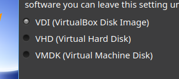
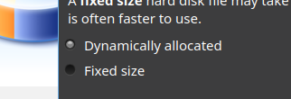

**Create sufficient disk space to install our 3 operating systems (for ex : 80GB)**

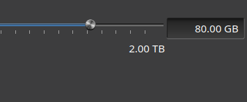

**Now let's adjust some settings, in virtualbox go to the "settings" option**
1. Go to "System" and enable "EFI Oses spacial".

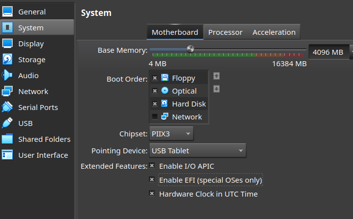

2. On "Processor" select more CPU like "4".

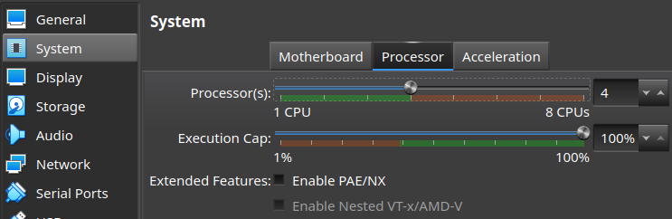

3. Go to "Display" and on "Video memory" add more memory like 64MB or 128MB.

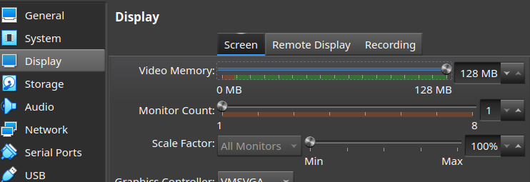

4. Go to Network and choose "Bridged adapter" or "NAT".

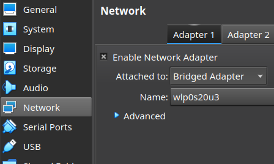

5. Go to "Storage" and create a new disk optical, attach you Archlinux iso file.

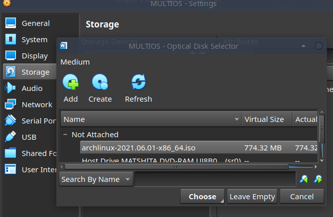
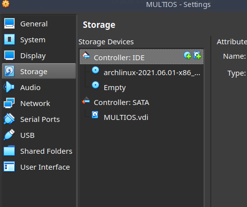

**After that you can make "apply" and start you virtual marchine, you must have the next screen :**

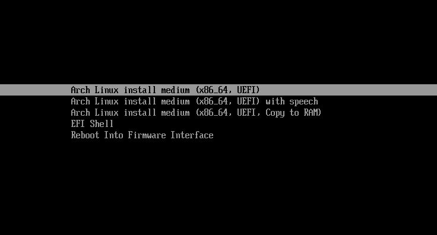

---

[So let's prepare EFI Partition](https://github.com/sysroot255/Install_Mutli_Boot_OS/blob/master/step2_create_EFI_partition_for_all_systems.md)

