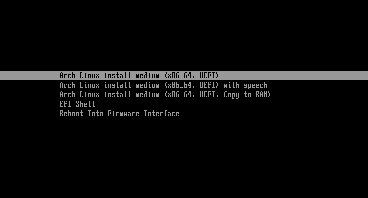

# Let's create our EFI partition

**We will therefore start with Archlinux to create the EFI (or ESP partition)(Extensible Firmware Interface) system partition**

**Start with selecting the first line "install medium x86_64 UEFI"**

**After a little loading time you should arrive on the following screen:**

    
    1. You can use some systemd command to understand how to find the appropriate keyboard layout :

`localctl list-keymaps` ( to list all layout)

`localctl list-keymaps | grep be`  (to find the Belgian variant)

    2. The keyboard must be in "US" , to change this you can use the following command :

`loadkeys be-latin1`

**Let's display the available disks to start with the first partition with the LSBLK command**

>We can see the "sda" disk that we had created in virtualbox.

>This disk does not contain any partition table and no main partition, so we will with the help of the "FDISK" command create the partition table using "GPT" and create our first partition "SDA1" which will have the parition type "EFI PARTITION"

>Use "m" command to show the menu of "DISK" and all possibility, in this way you will more easily understand the creation commands that we are going to use.

    1. Create a partition table with the command "g" and press enter.

    2. Create the first a new partition with the command "n" and press enter, as you can see, we ask you to choose the number of the first partition which automatically set to 1 so we need just confirm with "enter" then choose the sector which is also automatic so we also need to continue with "enter", for the third option it is the size of the partition that must be specified for this we will give at least 256Mo for this partition "+256M" and press "enter"

>Therefore:
            
    
- `fdisk /dev/sda` press "enter".

- `g` press "enter" (new table are created).

- `n` (new parition) press "enter".

- Press "enter" for the number of first partition.

- Press "enter" for the sector number.

- Define size of partition `+256M` and press "enter".

>By default the file system is in "ext4" we will modify it with the command "t" for type of parition, select the right type "EFI system" (1) and press "enter"

- `t` press "enter" (you can list all possibility parition with the right number to choose with the command "L")

- `L` number 1 is the good one to select ( quit the list with "q")

- `1` press "enter"

>Don't forget to save with write command "w" and say "yes", presse "enter"

- `w` press "enter" and confirm with `yes` "enter".

**You should get the message confirming that the partition type is changed from "file system partition" to "EFI system partition".**

>We can execute the "lsblk" command to see our created "SDA1" partition, we are going to format this parition with "mkfs" command.

- `mkfs.vfat -F32 /dev/sda1`  and press "enter"

>"vfat" or "fat" is the format that most operating systems can recognize during installations.

**Our EFI partion is ready and we can shut down our system or the virtual machine with the following command :**

- `shutdown now`

---

[Let's move on to installing windows 10](https://github.com/sysroot255/Install_Mutli_Boot_OS/blob/master/step3_install_windows10LTSC.md)

