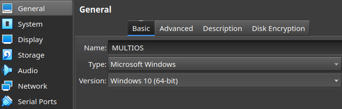
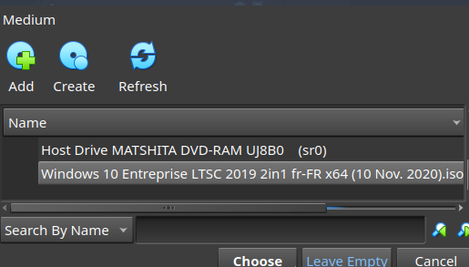
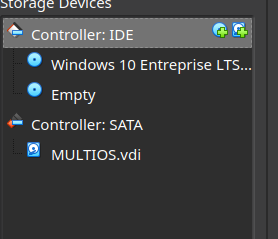
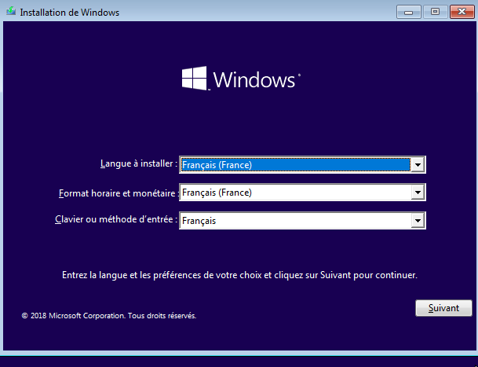
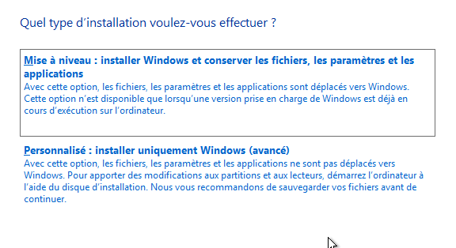
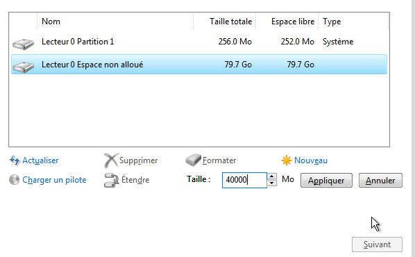
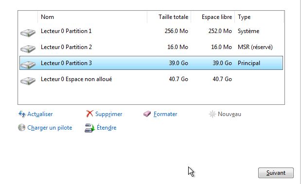
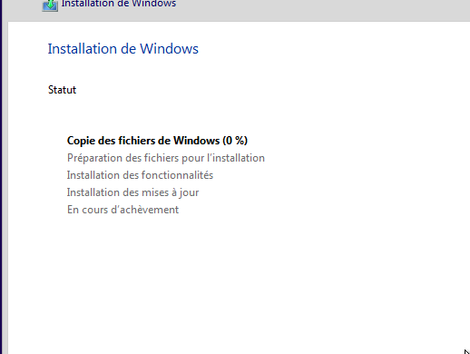
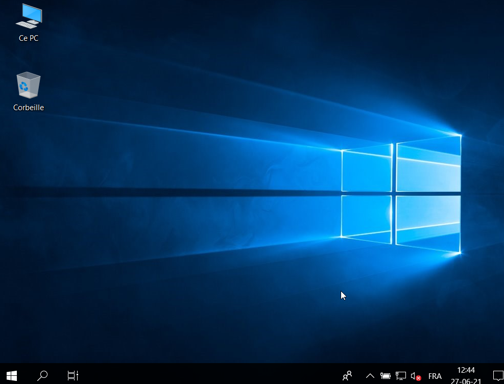

# Let's install a version of Windows.

**We are going in "virtualbox" to change the ISO file for this time to start on Windows.**

- For the moment on the storage section on virtualbox, let's delete the archlinux iso file to attach the one for the chosen windows version

**Start your virtual machine, you should start installing windows.**

**Select the installation mode customize in the choice of installation.**

**We can choose in the unallocated space a size in MB for our windows partition (ex: 40000).**

**Apply and we can see that windows has created two partitions, a reserved partition and an NTFS primary partition for the system.**

>(note to understand the different partitions under linux and windows)

1. /dev/sda1 sda1 is to the UEFI (ESP) partition created for all of our systems.
2. MSR(reserved) is /dev/sda2
3. Principal (40GB NTFS) is /dev/sda3

**Let's continue the installation.**

- Follow all the windows installation steps (choose user, password, preferences etc ...)

**In the end windows is well installed and we are done for this part, shut down your virtual machine.**

---

[Let's move on to installing Debian 10](https://gitea.86thumbs.net/Abdellah/Multiboot_os/src/branch/master/step4_install_Debian_buster_server_with_swap.md)