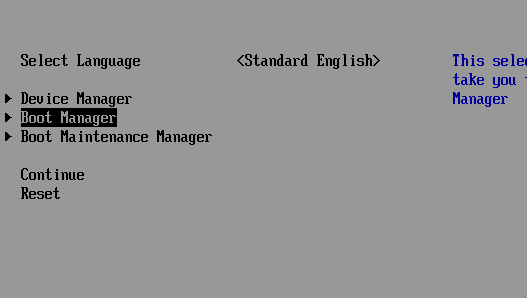
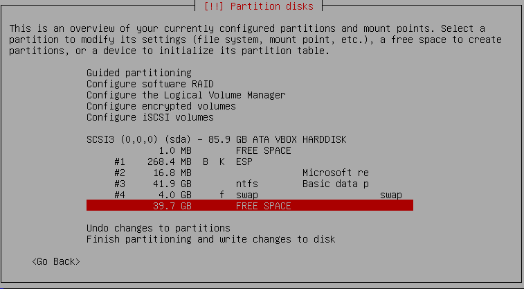
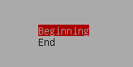
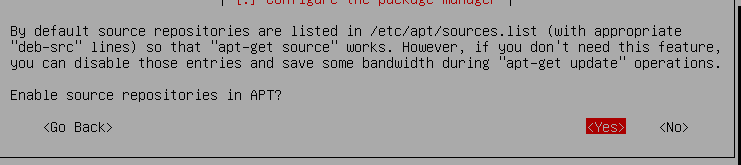

# Let's install Debian 10 buster (server)

**We will proceed in the same way with virtualbox, remove the windows iso file and then attach the debian one.**

**Here you have to be careful, for the moment there is only the default bios bootloader (windows bootmanager) so windows will want to start first.**

- Start your virtual machine with debian while pressing several times on the **"ESC"** key on the keyboard.

- Select the option **"BootManager"**, then choose the option **"UEFI VBOX CD-ROM"**.

**You should arrive at the debian 10 installation screen.**

**We select the advanced options and the expert install.**

**The installation starts in "expert" mode, we will configure all the steps to install a SERVER version of debian 10 (buster).**

- choose language (US for the system language).

- Select your country (here Belgium).

- Choose the locale for the system US (en_US.UTF8).
- select en_US using the **"SPACE"** key and continue.
> Use the "TAB" key to move through the button choices (useful in TUI mode).

- Select the good one ("en_US.UTF8" locale).

- Configure the keyboard (Belgian).

- Detect and mount CD-rom, on the "usb storage" screen, continue, then the message "cd-rom detected" appears, continue.

- Load installer components from CD.

>In this step you will be offered to load additional firmwares in the event that it would be useful to you, here we do not need it, just using the **"TAB"** key to go to **"continue"** .

- Loading components........

- Detecting Network and hardware, configure Network

    1. Say "yes" to auto-configure network.
    2. Waiting time leave to "3" by default.
    3. Set an hostname for your machine and continue.

- Set up users and password.

    1. Say "yes" to enable shadow password.

    2. Say "No" to allow login as root" (only use sudo).

    3. Define a user name and password.

- Configure The clock.

    1. Say "yes" for using NTP.

    2. Leave default address server and continue.

    
    3. Select time zone (Europe/Brussels)

- Partition Disks **(IMPORTANT SECTION)**.

    1. Select ""Manual method"".

    2. On the next screen we can see our first (#) 3 partitions already used for EFI and windows, so we will go to the "FREE SPACE" part to create a "SWAP" partition first.

    3. Press "enter" and create a new partition.

    4. Choose a size (for example 4 GB) and continue.

    5. Leave location at "beginning" and continue.

    6. On "how to use this partition" select "swap area" and continue.

    7. on the nex screen, select "Done settings and up the partition".

    8. Now we must create an "ext4" partition for de system (where the installation must be done for debian)

    9. Go to "FREE SPACE" and create one , It's the same procedure as for the swap but you just have to be careful when choosing the partition type.

    10. Choose a size for your server partition (10GB) and continue.

    11. Choose as type : "ext4 journaling file system".

    11. There you have it, the ext4 partition is created, you still have to choose "finish partitioning and write changes to disk", say "yes" to write.

- Install the base system.

    1. On "Kernel to install" choose "linux-image-amd64".

    2. On "drivers to include" select default "generic with all available drivers".

- Configure the package manager.

    1. Say "no" to "scan an other cd or dvd"

    2. Say "yes" on "use a network mirror", choose Belgium and select any mirror archive server and continue.

    3. For "Http proxy" leave blank and continue, for using contrib say "no" .

    4. For "enabling repository in APT" say "yes".

    5. On "service to use" leave default and continue.

- Select and install software.

    1. For "Update management system" say "yes" or "no" whether security updates can affect the entire system.

    2. For "choose software to install" select only component for a server (desktop environnement not installed) and continue.

**For the next step: it is important to know if you need "GRUB" yes or not, if your multi boot consists only of "windows" and "debian" then you can install grub on the disk "/ dev / sda "we will not see these steps for this installation because we will be installing archlinux as well and grub at the same time.**

    1. Here we skip the grub installation step by choosing "continue without grub".

    2. choose continue at this step :

    3. Now finish the installation

>Your virtual machine will restart but still without GRUB and will still try to launch windows automatically, this is why it is important to shutdown your virtual machine in order to be able to follow the next step: archlinux install

---

[Let's move on to installing Archlinux with GRUB](https://github.com/sysroot255/Install_Mutli_Boot_OS/blob/master/step5_install_Archlinux_with_grub_and_desktop_environnement.md)
