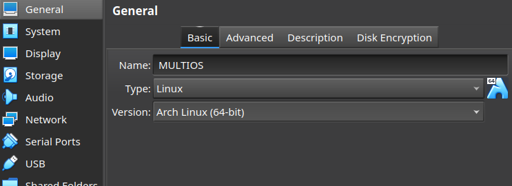
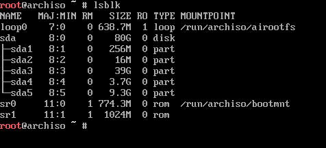

# Let's install Archlinux and only 1 Bootloader for all system (GRUB).

**We are now going to attach the archlinux iso again and remove the debian 10 iso.**

**Do not forget to start the virtual machine while pressing "ESC" to boot on the uefi bios and select "boot manager", then choose "UEFI VBOX CR-ROM".**

**Starting installation with the first choice Archlinux installa medium (x86_64 UEFI"**

**As for step2 (preparing efi), we are going to put the keyboard back temporarily to be-latin1.**

- `loadkeys be-latin1`

>If you are connected with ethernet cable in "NAT" or "Bridge" mode, ping google to make sure you have a working connection.

- `ip addr`  (to see ip configruation)
- `ping google.be` 

>if you must connect with the wifi connection, you have the "iwctl" tools.

- `iwctl`
- `station wlan0 scan`  (to scan wifi network to find SSID).

- `station wlan0 connect "SSID"` (and press "enter"), passphrase must be ask, specify the password and press "enter", exit.

- `exit`  (exit iwctl, try to `ping google.be` to be sure).

**Now we will use [reflector](https://wiki.archlinux.fr/Reflector) to update our repositories.**

- `reflector -c Belgium -a 6 --sort rate --save /etc/pacmand.d/mirrorlist`

**Update repositories with [pacman](https://wiki.archlinux.fr/pacman) command.**

- `pacman -Syy`

**Set the timedate NTP to "true"**.

- `timedatectl set-ntp true`

**Now let's create our partition to install our system.**

- `lsblk`  (to show all partition on disk)

- Little reminder

> **sda1** (EFI, ESP partition for all systems 256Mo)

> **sda2** (microsoft reserved 16Mo)

> **sda3** (NTFS partition windows 40Go)

> **sda4** (linux swap partition 4Go, swap for debian and for archlinux too).

> **sda5** ( linux file system ext4 for debian server 10Go)

- We will use the rest of the disk size to create our 6th parition for archlinux sda6.

- `fdisk /dev/sda`

    1. `n` (to create new partition)
    2. Press "enter" for the default number (6) partition.
    3. Press "enter" for the default sector choice.
    4. Press "enter" for the size of the parition, we using all the rest (27.6Go)
    5. `w` (to write partition on table, by default the type of partition is already good, ext4, linux file system)

- The partition is created, we will format it with mkfs.

- `mkfs.ext4 /dev/sda6`

**Mounting partitions to begin some package installation.**

>We need mount 3 partitions, sda1 for efi, sda4 (just swapon), sda6 for installation of archlinux. 

>/mnt is the directory for mounting our partitions.

 1. `mount /dev/sda6 /mnt`
 2. `swapon /dev/sda4`

>We need to create the directories to install our efi files for achlinux, here it will be "/mnt/boot/efi".

 3. `mkdir -p /mnt/boot/efi`
 4. `mount /dev/sda6 /mnt/boot/efi`

 

 > After that we can check if all partitions are mounted with `lsblk`.

 

**Let's install some base packages for our system.**

- `pacstrap /mnt base linux intel-ucode vim nano linux-firmware`

 

>if you have "amd processor" install "amd-ucode" package, you can also install an LTS Kernel with "linux-lts" package, for our installation we are using a rolling release kernel with just "linux" package.

 

 **We will generate our "fstab" file with the information of our partitions and the "UUID" option.**

 - `genfstab -U /mnt >> /mnt/etc/fstab`

 

 - Check if fstab is correctly generate.

 - `cat /mnt/etc/fstab`

 

 > we can see all partitions needed with UUID choice, you can also choose "LABEL" or other, use command `genfstab -m` to show help.

 **We will change the apparent root directory for the current running process and their children with [chroot](https://wiki.archlinux.org/title/chroot) command.**

 - `arch-chroot /mnt`

 

 >How can we see it, we are now in the environment that will allow us to continue our installation directly in the "root" system, so we can install source packages as well as modify our configurations as if we were in the system itself.

 **Let's configure some parameters concerning the "locales", host, etc.**

 - `ln -sf /usr/share/zoneinfo/Europe/Brussels /etc/localtime`

 

 - `hwclock --systohc`   [info hwclock](https://wiki.archlinux.org/title/System_time)

 - `nano /etc/local.gen`

 > remove the "#" in front of the system language and save and exit. (here "en_US.UTF-8")

 

 - `locale-gen` 

  

  - `echo "LANG=en_US.UTF-8" >> /etc/locale.conf`

  - `echo "KEYMAP=be-latin1" >> /etc/vconsole.conf`

  

  - `echo "archlinux" >> /etc/hostname` (set your prefered 
  hostname)

  > File host on /etc/hosts must be edited to add :

  - `nano /etc/hosts`

    - 127.0.0.1 localhost
    - ::1       localhost
    - 127.0.1.1 archlinux.localdomain archlinux

  > save and exit.

  

  > set a password to "root" user.

  - `passwd root`

  

**Now we are going to install the first group of packages to be installed with the "pacman" command.**

> - grub and efibootmgr (to install grub bootloader).
> - networkmanager, network-applet-manager, wpa_supplicant, inetutils, dnsutils (for networking and wifi).
> - dialog, dosfstools, mtools (useful tools needed).
> - git (to clone repositories), reflector (to create and update mirrolist repositories).
> - alsa-utils, pulseaudio, pulseaudio-bluetooth, bluez, bluez-utils, acpi, acpi_call (drivers for audio and bluetooth).
> - linux-headers (the header files define an interface, they specify how the functions in the source file are defined).
> - base-devel (is a package group that includes tools needed for building ).
> - powertop, tlp, (powermanagment).
> - cups (printing)
> - xdg-utils, xdg-user-dirs (for future environnement gnome or other)

- `pacman -S grub efibootmgr networkmanager network-manager-applet wpa_supplicant inetutils dnsutils dialog dosfstools mtools git reflector alsa-utils pulseaudio pulseaudio-bluetooth bluez bluez-utils acpi acpi_call linux-headers base-devel powertop tlp bash-completion cups xdg-utils xdg-user-dirs`

>when you launch the installation, it is normal for the manager package to ask you to choose the repository, by default we always take the first one so always do "enter" and start the download, the installation will be done automatically.

**Installation of GRUB bootloader.**

- `grub-install --target=x86_64-efi --efi-directory=/boot/efi --bootloader-id=GRUB`

>Before generating a configuration file for GRUB, we need to edit a file and add some information

- `nano /etc/default/grub`

>add **GRUB_DISABLE_OS_PROBER="fasle"** to the end of file, save and exit.

> mount the partition of "Debian"

- `mount /dev/sda5 /mnt`

> Now we can run `os-prober` command to be sure that Windows and Debian are included at the bootloader menu. (it is not necessary but just be sure).

**Now we can run the command to generate the grub file configuration.**

- `grub-mkconfig -o /boot/grub/grub.cfg`

**Enable some services with "systemctl" command.**

- `systemctl enable NetworkManager`

- `systemctl enable bluetooth`

- `systemctl enable cups`

- `systemctl enable tlp`

**Let's add a user and his rights. (sudo command)..**

- `useradd -mG wheel abysss` 
> ( m for creating home space, G to add to group wheel (sudo like), abysss is the username).

- `passwd abysss`
> set a password

> Now editing sudoers to remove "#" at the beginning of the line with "wheel"

- `EDITOR=nano visudo`

> remove "#" (wheel under root), save and exit.

**Now we finish the first step, we must exit "chroot" and umount partitions**

- `exit` (to exit chroot)

- `umount -a` (to umount all partitions, if you have some errors messages don't care about)

- `reboot now` (reboot your virtual machine)

>We must have after rebooting the next screen with choice grub bootloader and choice to run the oprating system that you want.

**Installations of a desktop environment, graphics drivers and other basic applications.**

> First now login with your user accout and password.

> Set timedate with timedatctl command, hwclock and install "rsync" package for reflector (mirrorlist).

- `sudo timedatectl set-ntp true`

- `sudo hwclock --systohc`

- `sudo pacman -S rsync`

> make a update only ! .

- `sudo pacman -Syy` (info on archwiki [pacman](https://wiki.archlinux.org/title/pacman))

> Enabling some new services with "systemctl" command.

- `sudo systemctl enable --now reflector.time`

- `sudo systemctl enable --now fstrim.timer`

> Install for this example Gnome desktop environment, graphics drivers, display manager, Xserver Xorg and some apps that you would need.

> - `xf86-video-intel` (intel graphics drivers, if you need amd replace intel by amd)

> - `xf86-video-vmware` (only needed here because we are using a virtual machine environment)

> - `xorg` (Xserver environment)

> - `gnome` (Gnome environment, you can also install `gnome-tweaks` for extra tools, games packages)

> - `gdm` (display manager, login)

> - `firefox`, `vlc`, `chromium` (if you want, you always can after install the rest of package like libre office or others)

> - for laptop or computer that need NVIDIA, you can install `nvidia` `nvidia-settings` `nvidia-utils` (not needed for this installation)

- **Let's install** :

- `sudo pacman -S xf86-video-intel xf86-video-vmware xorg gnome gdm firefox vlc`

> By default press everytime "enter" for choice of repositories.

> **IMPORTANT** : enable gdm service ( without that you have a blackscreen at boot), set X11 Belgian layout for GDM and GNOME.

- `sudo systemctl enable gdm.service`

- `localectl --no-convert set-x11-keymap be`

> Now we are finish, we can reboot the virtual machine

- `sudo reboot now`

**After that you can run "Archlinux" system and you must have the next login display manager.**

---

[Let's try some extra customization](https://github.com/sysroot255/Install_Mutli_Boot_OS/blob/master/step6_extra_customization_grub_pamac_others.md)

