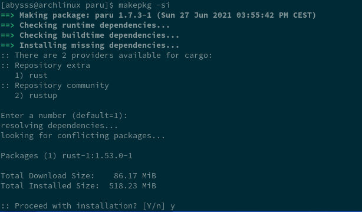
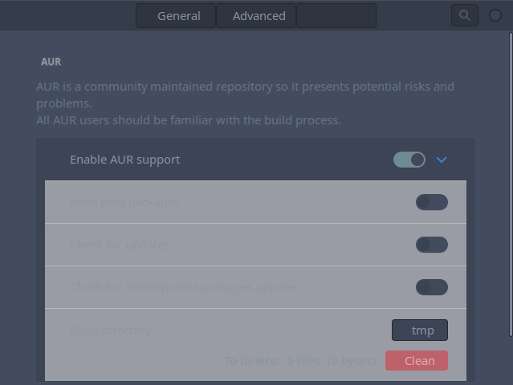
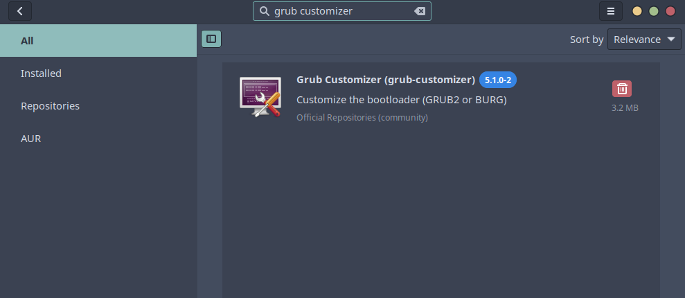
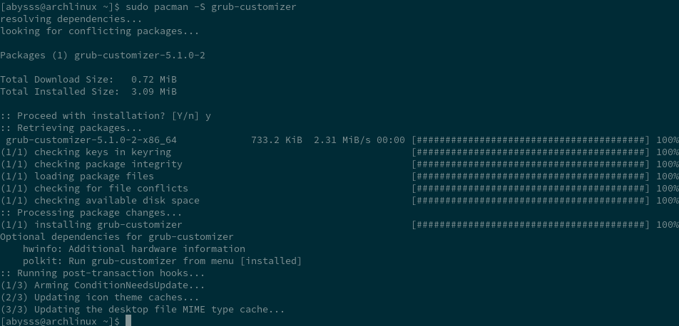

# This Step is only too add some customization for your desktop environment and adding AUR repository Archlinux.

  

 **AUR (Arch User Repository).**

 > The Arch User Repository (AUR) is a community-driven repository for Arch users. It contains package descriptions (PKGBUILDs) that allow you to compile a package from source with makepkg and then install it via pacman. ... The AUR community has the ability to vote for packages in the AUR.

 **Paru is your standard pacman wrapping AUR helper with lots of features and minimal interaction.**

 **Let's install it.**

 - `git clone https://aur.archlinux.org/paru.git`
 - `cd paru`
 - `makepkg -si`

 > set your password when asked.

 

 **Examples of command to use :**

 | Syntax | Description |
 | ----------- | ----------- |
 | paru **target** | Interactively search and install **target** |
 | paru | Alias for paru -Syu |
 | paru -S **target**  | Install a specific package |
 | paru -Sua | Upgrade AUR packages |
 | paru -Qua | Print available AUR updates |
 | paru -G **target**  | Download the PKGBUILD and related files of **target** |
 | paru -Gp **target**  | Print the PKGBUILD of **target** |
 | paru -Gc **target**  | Print the AUR comments of **target** |

 
 **Let's install with "paru" the software manager "pamac".**

 - `paru -S pamac-all` (this package include **snap** and **flatpak**)

 > If you only want officiel repositories with AUR use :

 - `paru -S pacman-aur`

 >After installation you must have the new software manager :

 

 **Enable AUR "search & install" with pamac.**

 > Go to menu "option", select preferences.

  

  > On the "third party" enable "AUR".

   

---

**Let's install Grub customizer (graphical interface).**

> install it with **pamac** if you want ! or with command line:

- `sudo pacman -S grub-customizer`

to be continued
AAAA

